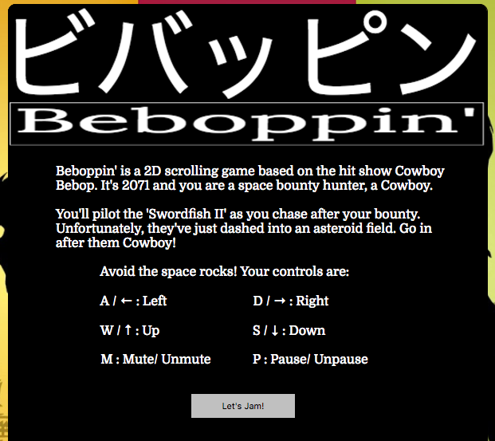
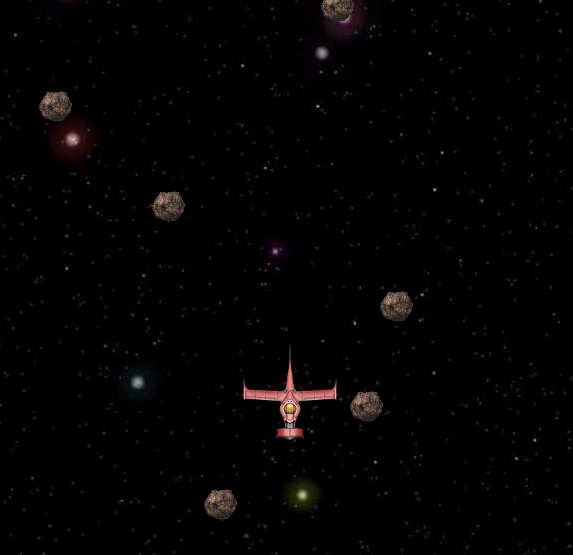
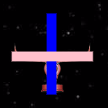
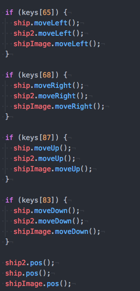
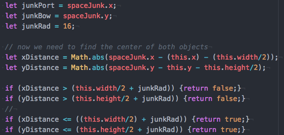

Beboppin'
-------------------
Beboppin' is a 2D vertical scroller based on the tv show "Cowboy Bebop".

Players take the role of a 'Space Cowboy', a space bounty hunter in the
year 2071. Travel between the planets is common, and so is crime. It's
up to the 'cowboys' to catch those on the run.

The player pilots their ship, Swordfish II, and must fly through an
asteroid field, to capture their bounty.

This project was created using HTML Canvas, JavaScript, and jQuery.

Features and Implementation
-----------------------

Upon loading the page, the player is show a splash page, telling them
about the setting, and the basic controls.

Once the user understands the basic controls and click on "Let's Jam",
the splash screen disappears. This is accomplished using an addEventListener, which waits for the player's click.

The function that handles the click uses jQuery to hide the splash
screen element, and fires another event, using jQuery again, that
animates a small element emerging from behind the canvas, displaying
the controls of the game. I decided to do this, in case the player
forgets the controls while playing.

Now we get to the main game!

The player can move their ship along using WASD keys, or the arrows keys, all of which are linked to 'keydown' and 'keyup' even listeners.
This allows the player to hold down a key/keys continuously.

The Ship

For the moment, we will focus on the ship. What the player can see is
a single image. Behind the scenes, the player is controlling not one,
but THREE objects at once.

Why was this done? The ship is an unusual shape, and not one that Canvas has an easy time of duplicating. (It is easiest to generate rectangles or circles). I didn't want a hit collision to register just because an asteroid hit one of the corners!

The three elements are created at the same time, and placed on the canvas in the appropriate
location. When the player taps a key, all three pieces move together as one!

So what happens if the one of these objects collides with an asteroid? Collisions are calculated between circles (the asteroids)
and rectangles (ship components). Each asteroid is generated randomly and placed in an array. Every interval of the game, the board is refreshed. During this refreshing period, each asteroid object's location, and the ship component's location is compared using this formula.

Essentially, what is being checked for here is if any part of the asteroid object is within a ship component. If it returns true, the game ends, and the player is given an option to restart.

Music
The soundtrack to Cowboy Bebop was a key component of the show, so I decided to include some of it here for the player to enjoy.

The game's soundtrack will begin playing the moment the game begins. But the player does have an option of muting it using a toggle. Using an event listener (which is waiting for a 'click' or a key press of 'm'), the game music will pause. Canvas does have the ability to play music, which is done by using the 'audio' tag. We can then (using jQuery) easily toggle this when needed.

Pause/UnPause/Restart
While the canvas appears to be moving smoothly, it is much more similar to film. When I initialized the game, I have a function that sets the 'interval', essentially the refresh rate at 20 milliseconds. This then calls the 'refresh' function every 20ms. It clears the entire canvas, and redraws every object with its now updated position.

To Pause the game, I used a function that acts like a toggle. Upon the player pressing 'p', the canvas gets the signal to 'clearInterval'. The stops the 'setInterval' dead in its tracks but still allows us to resume with another keypress.

To restart the game, I realized that I would need to delete all of the current objects on the canvas, reinitialize them, and have the game start over. 
